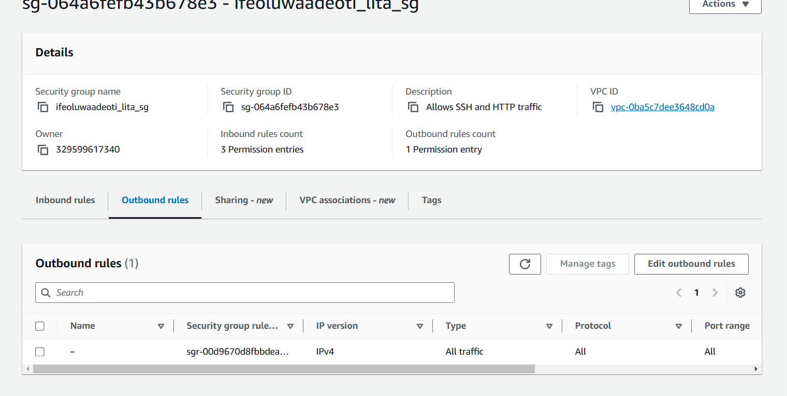

## Provisioning-EC2-instance-for-Smartshop
 LITA final Project
#### Company Overview
SmartShop  is a fictional mid-sized retail company that has recently decided to expand its business by launching an online store. As they anticipate an increase in web traffic due to marketing campaigns and seasonal sales, SmartShop requires a robust and reliable web infrastructure to ensure smooth customer experiences. With minimal in-house IT staff and a limited budget, they seek a cost-effective solution that can be manually adjusted for growth as needed, providing high availability and essential security while keeping operational complexity low.
#### Project Objective
As cloud engineers, your team is hired by SmartShop to design and deploy a reliable web application infrastructure on AWS. The solution should:
•	Support anticipated growth with flexible resource allocation.
•	Ensure high availability and consistent user experience.
•	Implement strong security measures to protect customer data.
•	Be cost-effective and optimized for performance.
#### Project Task
Set up VPC
Launch EC2 instance
Install Apache web
Enable monitoring and Logging

